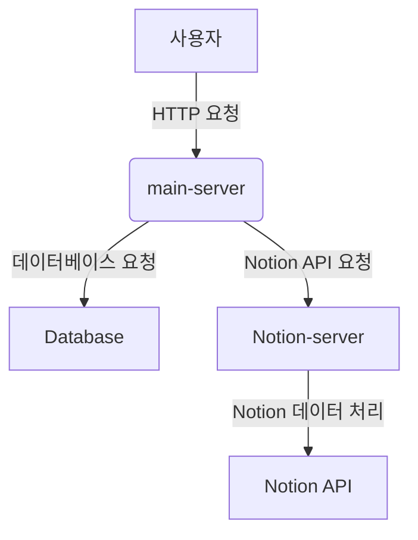

# Conaly API

## 프로젝트 설명

해당 서버는 flask, express등을 활용한 총 3개의 서버로 이루어져 있으며 docker를 활용하여 한 번에 빌드해야만 정상적인 작동이 가능합니다.

## 요구 사항

실행하는 컴퓨터 내에 도커가 설치되어 있어야 합니다.

- Node.js 18.x
- Docker
- Docker Compose

## 환경변수 설정

클론 이후에 프로젝트의 루트 위치에 .env를 추가하고 해당 파일에 환경 변수 코드를 붙여넣기 해주세요.
해당 레포를 공개 레포로 설정하여 환경변수를 노출시킬 수가 없어 해당 환경변수는 아래 제출 자료에 추가해뒀습니다.

- google form 레포지토리 부분
- chnoAI소개서 ppt 1페이지 슬라이드 노트 내용입력란(대본)

### 서버 실행

docker-compose-dev.yml 파일을 사용하여 컨테이너를 실행합니다:

```
docker-compose -f docker-compose-dev.yml up
```

서버 실행후 서버의 로그에서 진행상황을 확인할 수 있습니다. 일반적으로 AI로직 1회 실행시 5~10분정도 소요됩니다.

## 서버 구조 및 각 서버의 목표와 기능

### 서버 구조

본 프로젝트는 `main-server`와 `notion-server`, `ai-server`로 구성되어 있으며, 배포용 및 개발용 두 가지 환경에서 운영됩니다. 각 서버는 Docker를 사용하여 컨테이너화되어 있으며, `docker-compose`를 통해 배포 및 개발 환경을 설정합니다.

### 각 서버의 목표와 기능

#### Main Server

- **목표**

  - 사용자 요청을 처리하고, 데이터베이스와의 상호작용을 담당합니다.
  - 프로덕션 환경에서는 안정적이고 확장 가능한 구조를 유지하며, 개발 환경에서는 신속한 피드백을 제공하는 것이 목표입니다.

- **기능**
  - 사용자 인증 및 권한 관리
  - 데이터베이스 CRUD 작업
  - 외부 API와의 통신
  - 서버 사이드 렌더링 (SSR)

#### Notion Server

- **목표**

  - Notion API와의 통합을 통해 데이터 동기화 및 관리 작업을 수행합니다.
  - 사용자의 Notion 데이터와 애플리케이션의 데이터를 연동하여 통합적인 사용자 경험을 제공하는 것이 목표입니다.

- **기능**
  - Notion API를 통한 데이터 가져오기 및 업데이트
  - Notion 데이터의 로컬 데이터베이스 저장 및 동기화
  - 사용자 인터페이스에 제공할 데이터 가공

#### AI Server

- **목표**

  - 메인 서버로부터 AI로직 처리 요청을 받아 파이썬의 라이브러리들을 활용하여 LLM을 활용하는 작업 수행
  - 메인 서버로부터 링크와 함께 크롤링 요청을 받아 chatGPT공유링크 내의 정보를 크롤링하여 서버에 저장하는 작업 수행

- **기능**
  - 대화내용에 대한 기술문서 작성
  - 링크를 받아 해당 링크에 대한 크롤링 후 데이터베이스에 저장

### 서버 구조 다이어그램


